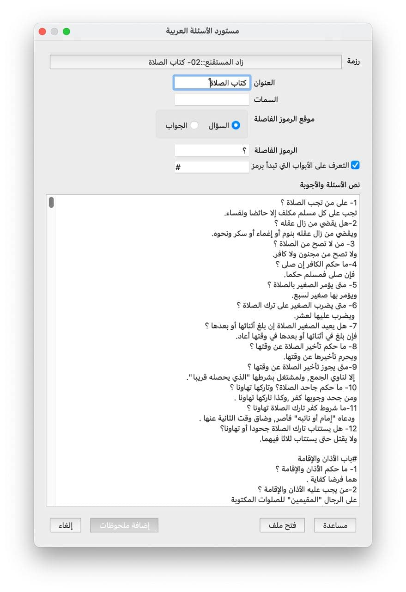
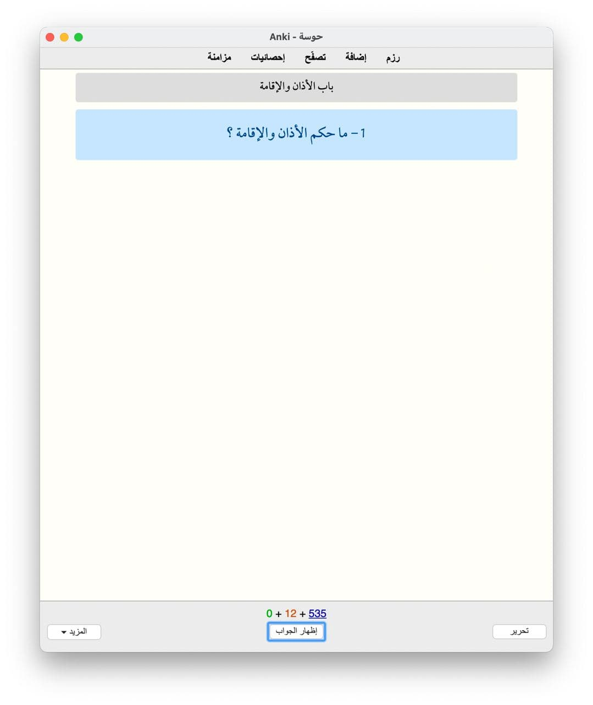
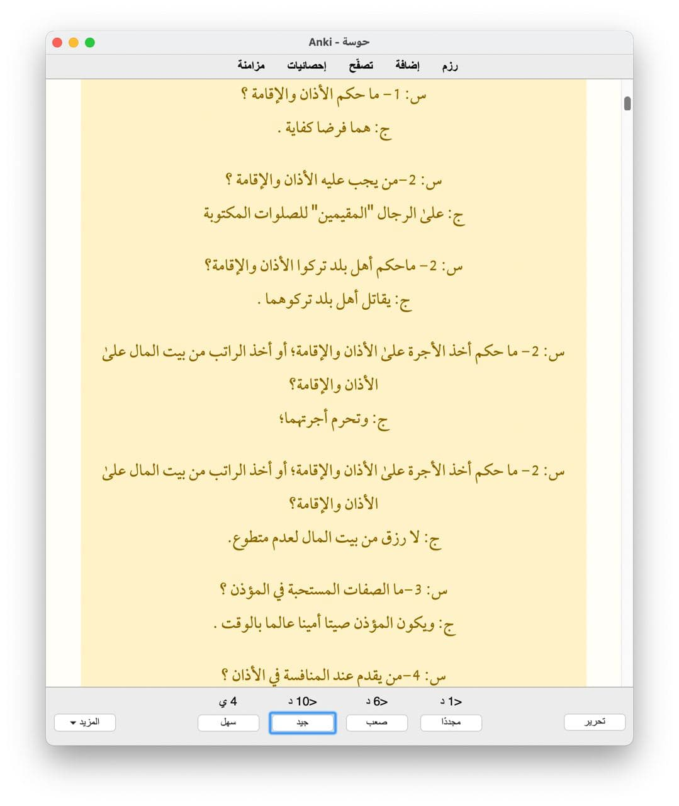

## مستورد الأسئلة العربية لأنكي

هذه إضافة لبرنامج [Anki](https://apps.ankiweb.net/) تسهل استيراد الأسئلة والأجوبة العربية المعلّمة برموز معينة.

توفر الإضافة واجهة بسيطة لاستيراد الملفات أو إدخال النصوص وخيارات لتخصيص الرموز المستخدمة لتمييز الأسئلة والأجوبة.

كما تأتي الإضافة مع قالب بطاقات مخصص:

الإضافة مبنية على إضافة [ARLPCG](https://ankiweb.net/shared/info/1642554134)،
والتي بدورها مشتقة من إضافة [LPCG](https://ankiweb.net/shared/info/2084557901).

## تنزيل

يمكنك تنزيل الإضافة من صفحتها على أنكي ويب: https://ankiweb.net/shared/info/1299710950

## الدعم

إذا كانت لديك أي أسئلة بخصوص الإضافة، يمكنك إرسالها إلى [مجموعة أنكي العربية التفاعلية على تلجرام](https://t.me/Ankiarabic_QA)،

أو يمكنك فتح منشور هنا على GitHub خصوصا إذا كنت تريد التبليغ عن عطل أو تريد المساهمة.

